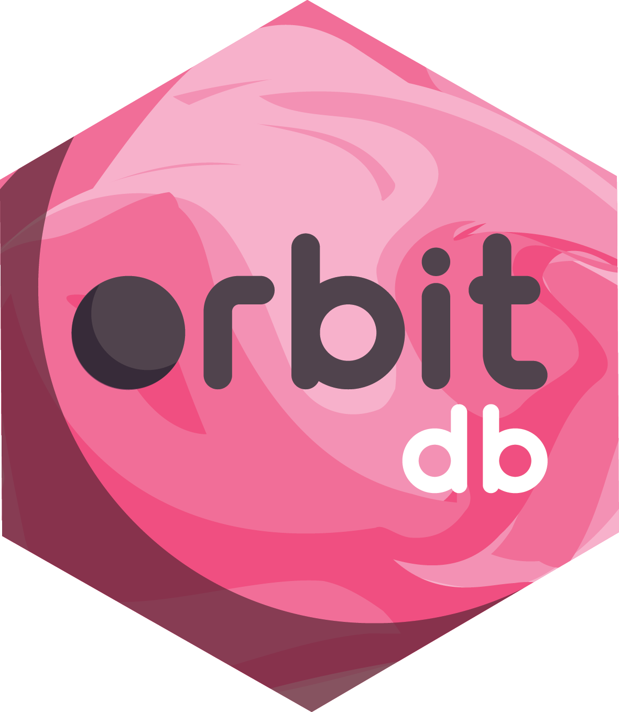
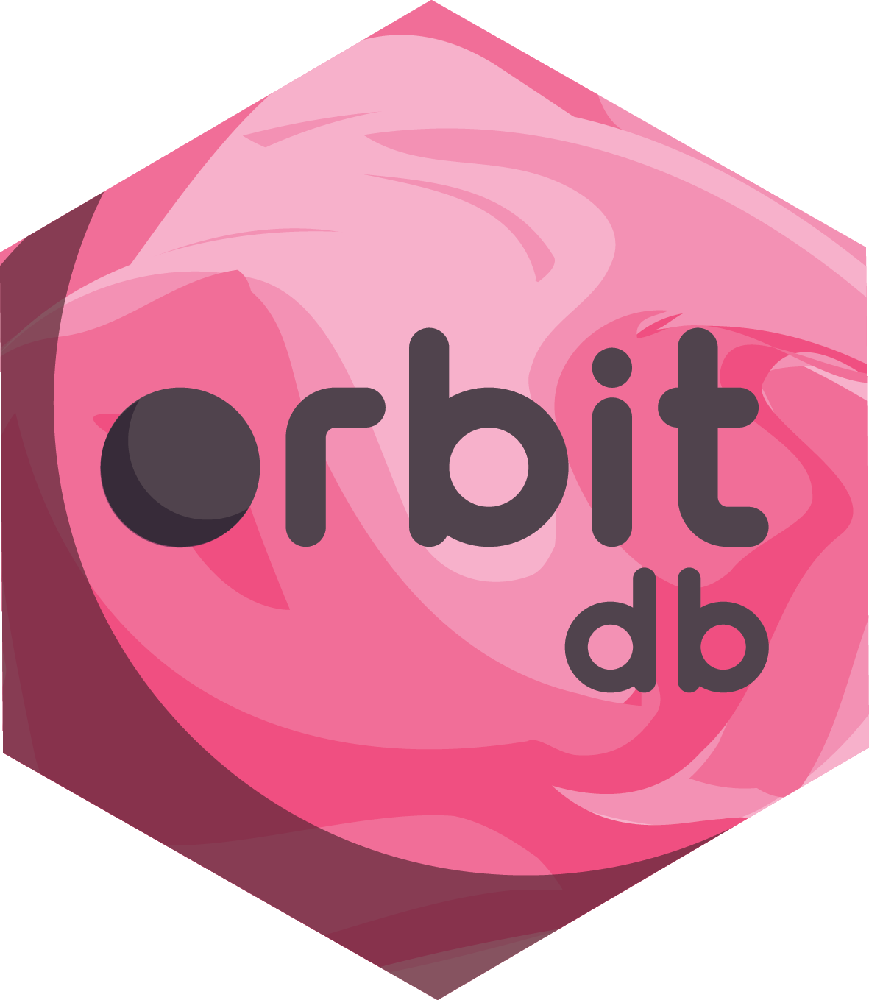
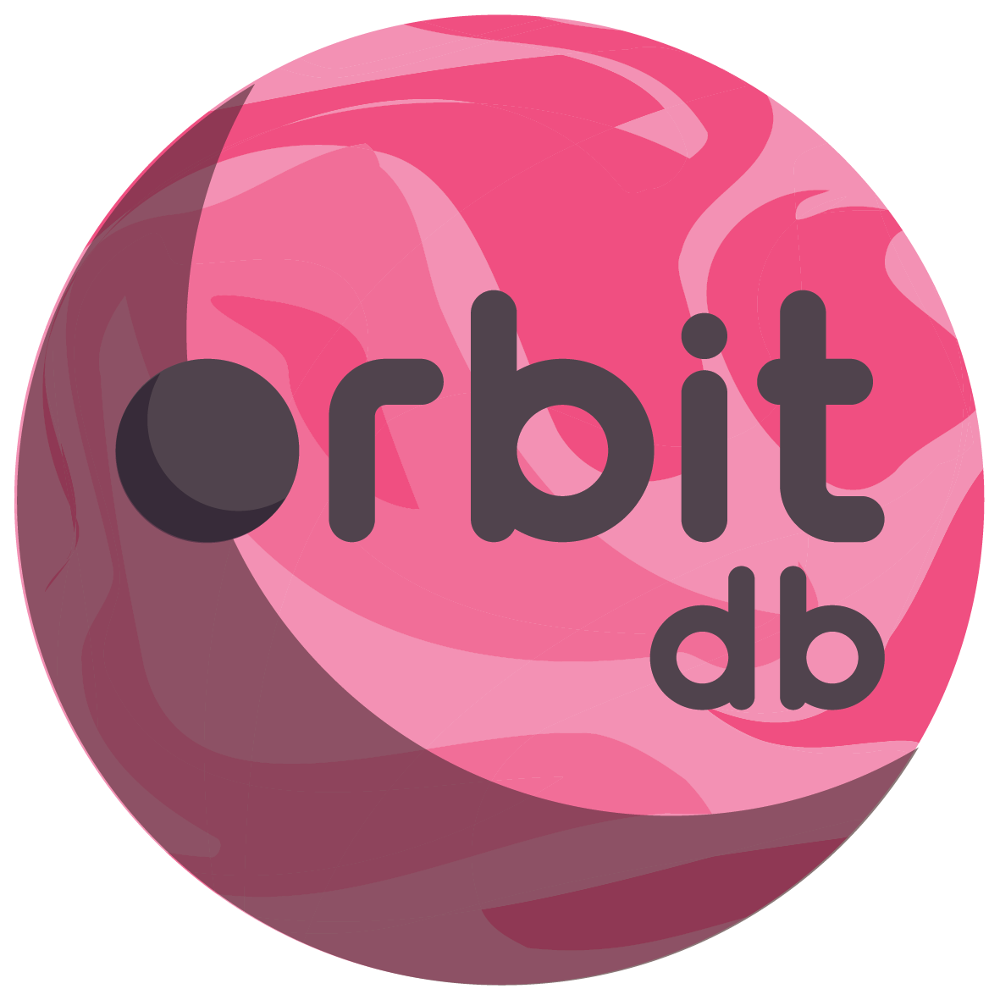
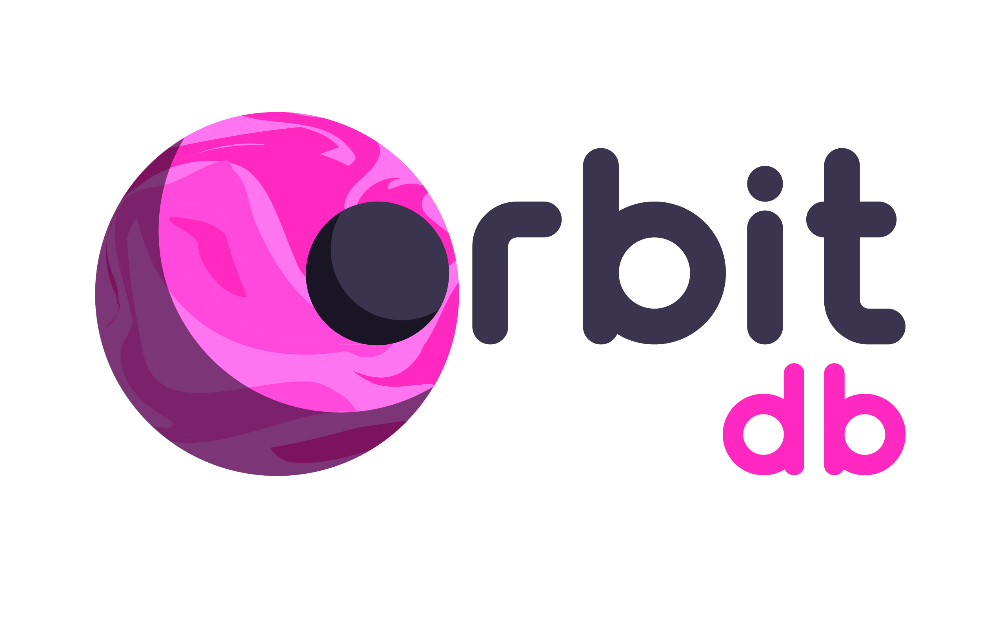

# Logo

Orbit's brand files, formats and guidelines.

- [Guidelines](orbit_db_guidelines.pdf)

In general, use the main standard logo when you can; the round one when you need either a circular logo or one with square dimensions (use a transparent background); the hexagons for JavaScript related events (especially for stickers); and the wordless ("sans mot") logos when the icon needs to be small and the text isn't as important.

If you're unsure about using any of these, reach out and open an issue!

### Standard Logos

### Hexagons

### Sans Mots

## Variations

## Contributing

Feel free to open an issue if you have any questions.

Please note that all interactions in [@OrbitDB](https://github.com/orbitdb) fall under our [Code of Conduct](CODE_OF_CONDUCT.md).

## License

Attribution-ShareAlike 4.0 International (CC BY-SA 4.0) CC-BY-SA © Pablo Rozenberg 2018. To view a copy of this license, visit http://creativecommons.org/licenses/by-sa/4.0/ or send a letter to Creative Commons, PO Box 1866, Mountain View, CA 94042, USA.
